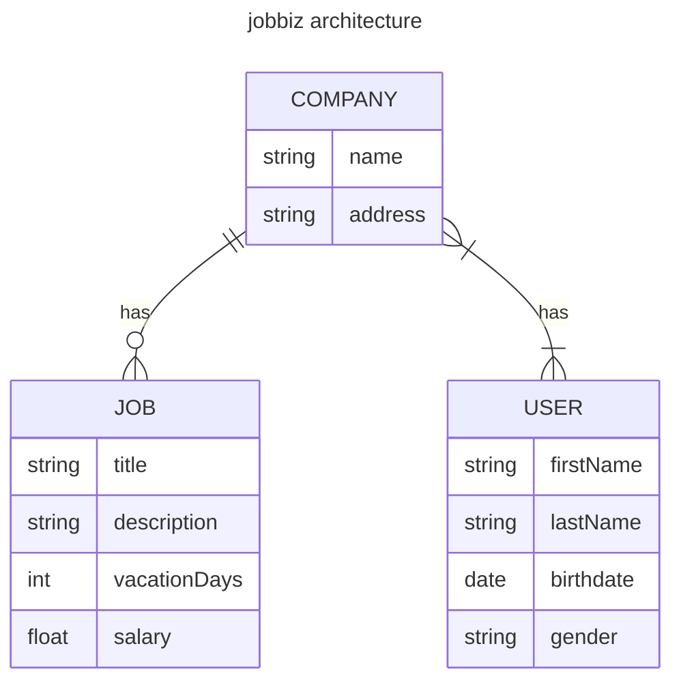

# tm-cs-jobbiz
Platform managing job offers written with php/laravel
## Architecture

```mermaid
---
title: jobbiz architecture
---
erDiagram
    COMPANY ||--o{ JOB : "has"
    COMPANY }|--|{ USER : "has"
    COMPANY {
        string name
        string address
    }
    JOB {
        string title
        string description
        int vacationDays
        float salary
    }  
    USER {
        string firstName
        string lastName
        date birthdate
        string gender
    }
```
